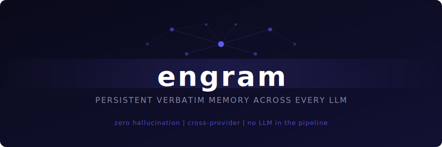

<p align="center">
  
</p>

<p align="center">
  <a href="https://github.com/abhishekdeore/engram"></a>
  <a href="https://github.com/abhishekdeore/engram"></a>
  <a href="https://github.com/abhishekdeore/engram"></a>
  <a href="https://github.com/abhishekdeore/engram"></a>
  <a href="https://github.com/abhishekdeore/engram/blob/main/LICENSE"></a>
</p>

<p align="center">
  <strong>Ask Claude what you discussed with ChatGPT last Tuesday.</strong><br/>
  <strong>Ask Gemini to continue the research you started with Grok.</strong><br/>
  <em>Engram makes it possible -- without modifying, summarising, or hallucinating a single word.</em>
</p>

---

## The Problem

Every LLM has isolated memory. If you research a topic with ChatGPT on Monday, ask Claude about it on Wednesday, and switch to Gemini on Friday -- each one starts from zero. There is no shared memory layer. Your context is trapped inside whichever chat window you happened to use.

This means you repeat yourself, lose continuity, and can never build a persistent knowledge base across the tools you actually use.

## What Engram Does

Engram is a **persistent, verbatim memory layer** that works across every major LLM. When you choose to save a conversation, it is stored **word for word** in a Neo4j knowledge graph. When you need it back -- from any LLM, on any device, at any time -- semantic vector search retrieves the exact text and hands it to whichever model you are talking to.

```
User --> ChatGPT:  "Research quantum computing error correction for me"
ChatGPT responds with a 3000-word document

User --> ChatGPT:  "Save this to my memory"

            --- three days later, different device ---

User --> Claude:   "Do you remember that quantum computing research?"
Claude retrieves the full verbatim ChatGPT exchange from Engram
Claude --> User:   "Yes, here is exactly what was documented: ..."
```

The conversation comes back **word for word**. Not a summary. Not a paraphrase. Not an AI-generated approximation. The exact text.

---

## Why Verbatim Matters

Most memory systems summarise, compress, or distill your conversations before storing them. That means an LLM decides what is important and what gets thrown away -- before you ever ask for it back.

Engram takes a fundamentally different approach:

> **There is no LLM anywhere in the memory pipeline.**

What goes in comes out unchanged. The entire storage and retrieval path is deterministic:

| Step | What Happens | LLM Involved? |
|------|-------------|:-:|
| User says "save this" | Full conversation stored verbatim in Neo4j | No |
| Embeddings computed | OpenAI `text-embedding-3-small` encodes text for search | No (embedding model, not generative) |
| User queries memory | Semantic vector search finds relevant conversations | No |
| Results returned | Exact stored text handed to the requesting LLM | No |

The LLM you are talking to receives the raw, unmodified text. It can then reason about it, summarise it, or build on it -- but the **source material is always the original words**. This is the difference between a memory system and a hallucination system.

---

## Supported Providers

Engram integrates natively with every major LLM through the **Model Context Protocol (MCP)** -- the emerging standard for how AI models connect to external tools.

| Provider | Integration | Status |
|----------|------------|--------|
| **Claude** (Anthropic) | MCP stdio -- runs directly in Claude Desktop | Live |
| **ChatGPT** (OpenAI) | Custom GPT Action + MCP Streamable HTTP server | Live (Custom GPT), MCP pending App Directory |
| **Gemini** (Google) | MCP server | Planned |
| **Grok** (xAI) | MCP server | Planned |
| **Copilot** (Microsoft) | MCP server / Copilot Extensions | Planned |

All providers read from and write to the **same memory graph**. A conversation saved from ChatGPT is immediately available to Claude, Gemini, and every other connected LLM.

---

## Use Cases

### Cross-LLM Continuity
Start a research thread with ChatGPT, continue it with Claude, refine it with Gemini. Every model sees the full history -- verbatim -- without you copying and pasting between chat windows.

### Personal Knowledge Base
Every important conversation you have with any AI becomes part of a persistent, searchable knowledge graph. Job applications, research threads, technical decisions, personal notes -- all stored exactly as discussed, retrievable by any model.

### Agentic Memory
Give your AI agents long-term memory that persists across sessions and providers. An agent can:
- Store research findings in one session and retrieve them in the next
- Build on previous conversations without re-prompting
- Access context from other agents working on the same problem

Because memory is stored as a graph (not flat text), agents can traverse conversation relationships, filter by provider or date, and retrieve precisely the context they need within a token budget.

### Team Knowledge (Future)
Multiple users sharing a memory namespace. One team member's ChatGPT research is available to another team member's Claude session -- with ownership, access control, and audit trails built into the graph.

---

## Architecture

```
                    +------------------+
                    |   Claude Desktop |  MCP stdio
                    +--------+---------+
                             |
+------------------+         |         +------------------+
|     ChatGPT      +---------+---------+     Gemini       |  MCP HTTP
+------------------+         |         +------------------+
                             |
                    +--------v---------+
                    |   Engram Server   |
                    |   (FastAPI + MCP) |
                    +--------+---------+
                             |
                    +--------v---------+
                    |      Neo4j       |
                    |  Knowledge Graph |
                    +------------------+

         Conversations stored as graph nodes
         Embeddings enable semantic search
         No generative model in the pipeline
```

### The Graph

Conversations are stored as a connected graph -- not flat rows in a database:

```
User
  --> has conversation --> Conversation (provider, model, date)
                             --> has message --> Message (role, content, timestamp)
                             --> has segment --> Segment (embedding, 20-message window)
```

**Messages** store the verbatim text. **Segments** are 20-message windows with embeddings -- the unit of semantic search. The graph structure enables traversal queries that flat vector databases cannot express: "all conversations with ChatGPT about machine learning from last week" resolves through graph relationships, not string matching.

### How Retrieval Works

When you ask any connected LLM about a past conversation:

1. **Date filtering** -- if your query mentions a date ("last Tuesday", "March 5th"), the search is scoped to that time window first
2. **Embedding** -- your query is embedded using the same model that encoded the stored conversations
3. **Three parallel vector searches** -- Segment, Message, and Chunk indexes are searched simultaneously
4. **Deduplication** -- results are merged by conversation, highest relevance score wins
5. **Token budget assembly** -- results are packed into the response up to the configured token limit
6. **Verbatim return** -- the exact stored text is returned to the LLM

If vector search finds no strong matches, a full-text fallback ensures natural language queries still work.

---

## What Makes Engram Different

| | Engram | Typical AI Memory |
|---|---|---|
| **Storage** | Verbatim -- exact words stored | Summarised or compressed |
| **Retrieval** | Original text returned | AI-generated summary returned |
| **LLM in pipeline** | None -- fully deterministic | LLM decides what to keep |
| **Cross-provider** | Any LLM reads any LLM's conversations | Locked to one provider |
| **Data model** | Knowledge graph (Neo4j) | Flat vector store |
| **User control** | Explicit save trigger only | Often automatic / opaque |

---

## Stack

| Layer | Technology |
|-------|-----------|
| API server | FastAPI + Uvicorn |
| Knowledge graph | Neo4j 2026.x |
| Auth | JWT (HS256) |
| Embeddings | OpenAI `text-embedding-3-small` (1536 dims) |
| Semantic search | Neo4j vector indexes, cosine similarity |
| Rate limiting | slowapi (per-user, JWT-decoded key) |
| Cache | Redis (optional -- embedding + query cache) |
| MCP (local) | stdio transport -- Claude Desktop |
| MCP (remote) | Streamable HTTP transport -- ChatGPT Apps, all HTTP clients |
| Runtime | Python 3.11+, uv |

---

## Getting Access

Engram is in active development. Self-registration is not available yet. To get onboarded:

1. **Contact Abhishek Deore** to request an API key and user ID:
   - Email: **abhisdeore4263@gmail.com**
   - LinkedIn: [Abhishek Deore](https://www.linkedin.com/in/abhishekdeore/) -- send a message

2. You will receive:
   - An **API URL** (the Engram server address)
   - An **API Key** (a JWT that encodes your user ID, valid for 1 year)

That is all you need. No database credentials, no OpenAI key, no server setup.

---

## Setup -- Claude Desktop

**Prerequisites:** macOS or Windows, [Claude Desktop](https://claude.ai/download), Python 3.11+, [uv](https://docs.astral.sh/uv/)

1. Clone the repo and install dependencies:
   ```bash
   git clone https://github.com/abhishekdeore/engram.git
   cd engram
   uv sync
   ```

2. Edit `~/Library/Application Support/Claude/claude_desktop_config.json` (macOS) or `%APPDATA%\Claude\claude_desktop_config.json` (Windows):
   ```json
   {
     "mcpServers": {
       "engram-memory": {
         "command": "uv",
         "args": ["run", "engram-mcp"],
         "cwd": "/your/path/to/engram",
         "env": {
           "ENGRAM_API_URL": "<your API URL>",
           "ENGRAM_API_KEY": "<your API key>"
         }
       }
     }
   }
   ```

3. Restart Claude Desktop. Say **"Do you remember..."** or **"Save this to memory"** to use it.

---

## Setup -- ChatGPT (Custom GPT)

1. Go to [chatgpt.com/gpts/editor](https://chatgpt.com/gpts/editor) and create a new GPT
2. Paste the system prompt from [`chatgpt_integration/system_prompt.md`](chatgpt_integration/system_prompt.md)
3. Under **Actions**, click **Import from URL** and paste:
   ```
   https://engram-production-d6d1.up.railway.app/chatgpt/action-spec
   ```
4. Set authentication: **API Key** / **Bearer** / paste your API key
5. Save the GPT. Done -- say **"Save this conversation"** or **"Do you remember..."**

For detailed instructions, troubleshooting, and the system prompt reference, see [`CHATGPT_SETUP.md`](CHATGPT_SETUP.md).

---

## Roadmap

- [x] **Phase 0** -- Neo4j schema, constraints, vector + full-text indexes
- [x] **Phase 1** -- Write API, conversation segmentation, JWT auth
- [x] **Phase 2** -- Embedding pipeline, 3-index semantic search, query API
- [x] **Phase 3** -- Read/delete API, provider adapters (ChatGPT, Claude, Gemini, Grok, Copilot), rate limiting, observability
- [x] **Phase 4** -- MCP server for Claude Desktop (stdio), write retry with exponential backoff
- [x] **Phase 5A** -- ChatGPT integration: MCP HTTP/SSE server, Custom GPT Action, API key endpoint, MCP stdio rewrite (API client mode), Railway deployment
- [ ] **Phase 5B** -- Gemini MCP server
- [ ] **Phase 5C** -- Grok, Copilot MCP servers
- [ ] **Phase 6** -- Production hardening: Docker Compose, Prometheus metrics, connection resilience
- [ ] **Phase 7** -- Semantic fact versioning: automatic update detection across conversations

---

## License

MIT

---

<p align="center">
  <sub>Built by <a href="https://github.com/abhishekdeore">Abhishek Deore</a></sub>
</p>
